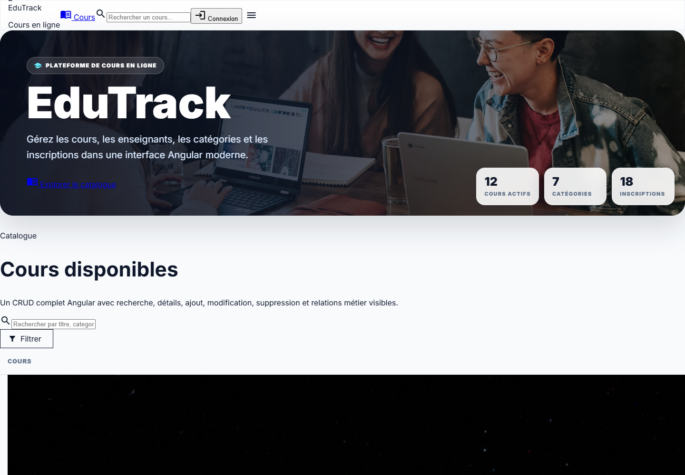
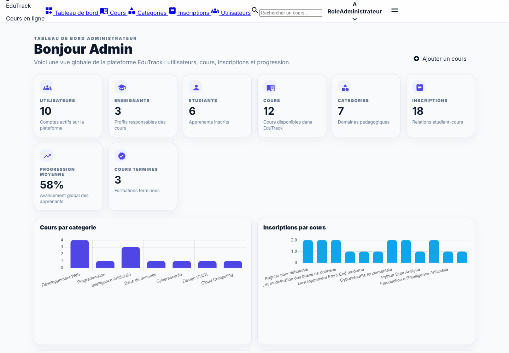

# EduTrack

[](https://github.com/KhaledZouari/edutrack/actions/workflows/ci.yml)
[](LICENSE)

A role-based online course management platform for administrators, instructors,
and students.

## Features

- JWT authentication and role-based authorization
- User, course, enrollment, and lesson management
- Dedicated workflows for administrators, instructors, and students
- Input validation and centralized API error handling
- Swagger/OpenAPI documentation

## Stack

| Layer | Technology |
| --- | --- |
| Frontend | Angular, TypeScript |
| Backend | Java 21, Spring Boot, Spring Security |
| Data | PostgreSQL, H2 for local development and tests |
| Quality | Maven, JUnit, Angular build checks, GitHub Actions |

## Architecture

The frontend separates feature modules, shared components, models, route guards,
and HTTP services. The backend separates controllers, DTOs, entities,
repositories, services, security, and exception handling.

## Local setup

Prerequisites: Java 21, Node.js 22, and npm.

```bash
git clone https://github.com/KhaledZouari/edutrack.git
cd edutrack/edutrack-frontend
npm ci
npm start
```

In a second terminal:

```bash
cd edutrack/edutrack-backend
./mvnw spring-boot:run
```

On Windows, use `.\mvnw.cmd`. The frontend runs at `http://localhost:4200`; the
API and Swagger UI run under `http://localhost:8081/api`.

## Configuration

Copy the documented values from `edutrack-backend/.env.example`. Angular
environment files contain frontend configuration; never place private
credentials in browser-exposed variables.

## Verification

```bash
cd edutrack-backend && ./mvnw verify
cd ../edutrack-frontend && npm ci && npm run build
```

CI runs these checks on pushes and pull requests targeting `main`.

## Business context and engineering approach

### Learning-platform operations

Students browse courses and enroll; teachers manage learning content;
administrators manage the platform. Angular screens communicate with Spring Boot
services and a relational data model for users, courses and enrollments.

Route guards organize browser navigation while server-side authorization remains
the access-control boundary. DTO validation and separated repositories keep
request handling distinct from persistence.

## Application screenshots

Captured from the running application on 3 October 2026.

### Course catalog



Browse the seeded courses and categories.

### Administrator dashboard



Administrative overview from a real authenticated local session.

## Evidence and current scope

These captures use the seeded local H2 dataset. The test profile disables
Firebase initialization; it demonstrates local password authentication and does
not validate Google sign-in or a production PostgreSQL deployment.

### Local capture configuration

The default development profile also requires Firebase credentials. For the
local screenshots, the existing test profile was used with H2 and the seeded
accounts. On Windows:

```powershell
cd edutrack-backend
.\mvnw.cmd spring-boot:run "-Dspring-boot.run.profiles=test"
```

This configuration disables Firebase initialization. It is for local
demonstration, not deployment.

## License

Distributed under the MIT License. See [LICENSE](LICENSE).
