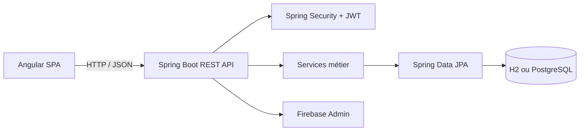

# EduTrack

[](https://github.com/KhaledZouari/edutrack/actions/workflows/ci.yml)

Application web de gestion de cours en ligne avec parcours distincts pour les
administrateurs, les enseignants et les étudiants.

## Fonctionnalités

- Authentification JWT et contrôle d’accès par rôles `ADMIN`, `TEACHER` et
  `STUDENT`.
- Gestion des utilisateurs, catégories, cours et inscriptions.
- Suivi de progression et tableaux de bord adaptés à chaque rôle.
- Documentation interactive de l’API avec OpenAPI et Swagger UI.

## Stack

- Backend : Java 21, Spring Boot, Spring Security, Spring Data JPA, H2 et
  PostgreSQL.
- Frontend : Angular 19, Angular Material, Chart.js et TypeScript.
- Services : Firebase Admin et Firebase côté client.

## Architecture



Le frontend sépare les fonctionnalités, composants partagés, modèles, guards
et services HTTP. Le backend organise les contrôleurs, DTO, entités,
repositories, services, sécurité et gestion des erreurs par responsabilité.

## Installation

Prérequis : Java 21, Node.js 20 et npm.

```bash
git clone https://github.com/KhaledZouari/edutrack.git
cd edutrack/edutrack-frontend
npm ci
npm run build
```

```bash
cd ../edutrack-backend
./mvnw test
./mvnw spring-boot:run -Dspring-boot.run.arguments=--server.port=8081
```

Sous Windows, remplacer `./mvnw` par `.\mvnw.cmd`. L’application Angular est
accessible sur `http://localhost:4200` avec `npm start`; l’API et Swagger sont
disponibles sur `http://localhost:8081/api` et
`http://localhost:8081/swagger-ui.html`.

## Configuration

| Variable | Service | Description |
|---|---|---|
| `FIREBASE_CONFIG_JSON` | Backend | JSON du compte de service Firebase. |

Le modèle est fourni dans `edutrack-backend/.env.example`. Le frontend utilise
les fichiers d’environnement Angular; `edutrack-frontend/.env.example`
documente les valeurs locales attendues mais n’est pas chargé automatiquement.

## Tests et qualité

```bash
cd edutrack-backend && ./mvnw verify
cd ../edutrack-frontend && npm ci && npm run build
```

La CI exécute ces vérifications sur chaque pull request et chaque push sur
`main`. Le profil `test` utilise une base H2 en mémoire et désactive
l’initialisation Firebase externe.

## API

Les ressources principales sont exposées sous `/api/auth`, `/api/users`,
`/api/categories`, `/api/courses`, `/api/enrollments` et `/api/dashboard`.
La spécification complète est consultable via Swagger UI après démarrage.

## Captures d’écran

Les futures captures sont regroupées dans `docs/screenshots/` afin de garder
une documentation stable et versionnée.

## Choix techniques

- JWT isole l’authentification de la SPA et sécurise les routes par rôle.
- Les DTO séparent le contrat HTTP des entités persistées.
- H2 facilite le développement local et les tests; PostgreSQL est disponible
  comme moteur relationnel d’exécution.

## Limites connues et pistes d’amélioration

- La suite backend vérifie le démarrage du contexte et les contraintes des DTO ;
  les règles de progression et de rôle ne sont pas encore testées isolément.
- La migration Angular 19 vers une version corrigée est prioritaire : l’audit
  npm remonte 31 alertes dans l’outillage, dont une critique, mais la correction
  impose une migration majeure qui doit être testée séparément.
- Ajouter des tests d’intégration des contrôleurs et des parcours Angular.
- Fournir une configuration Docker Compose pour l’API, le frontend et
  PostgreSQL.

## Licence

Ce projet est distribué sous licence MIT. Voir [LICENSE](LICENSE).
